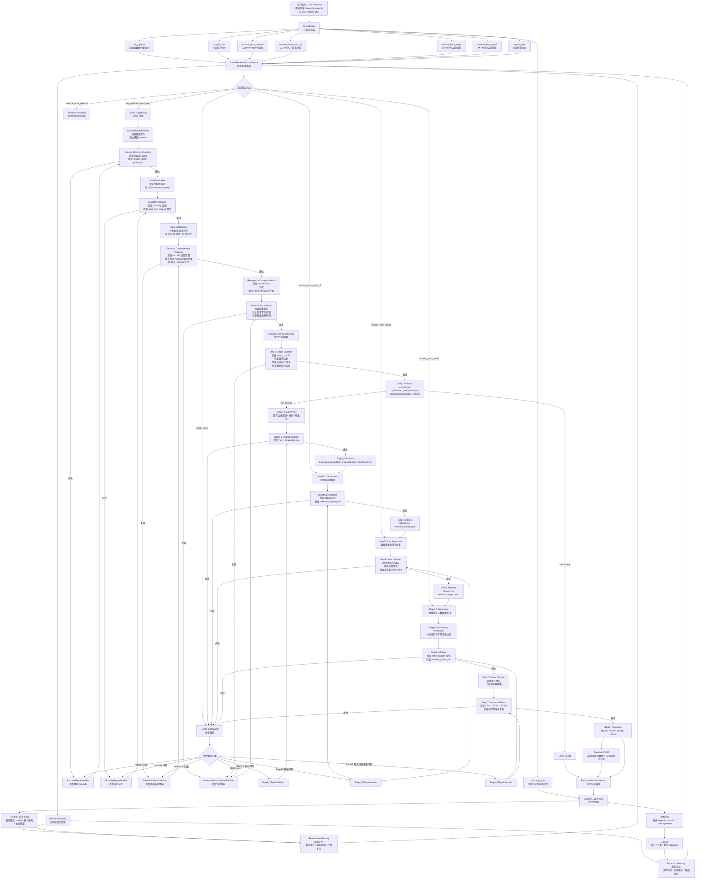

```mermaid
flowchart TD
    U["用户输入 / User Request<br/>原始目录 / records.json / 中间 CSV / repair 请求"] --> R["Task Router<br/>任务分流器"]

    R --> T1["full_pipeline<br/>从原始数据完整运行"]
    R --> T2["step1_only<br/>只运行 Step1"]
    R --> T3["resume_from_records<br/>从 records.json 续跑"]
    R --> T4["resume_from_step2_3<br/>从 Step2_3 结果续跑"]
    R --> T5["resume_from_step4<br/>从 Step4 结果续跑"]
    R --> T6["resume_from_step5<br/>从 Step5 结果续跑"]
    R --> T7["repair_task<br/>局部修复任务"]
    R --> T8["memory_only<br/>只做记忆查询或反思"]

    T1 --> O["State-Machine Orchestrator<br/>状态机编排器"]
    T2 --> O
    T3 --> O
    T4 --> O
    T5 --> O
    T6 --> O
    T7 --> O
    T8 --> M0["Memory Supervisor<br/>记忆管理器"]

    O --> P0["Pre-run Advisory<br/>运行前记忆检索"]
    P0 --> PM["Playbook Memory<br/>规则记忆<br/>流程约束 / 失败模式 / 输出契约"]
    P0 --> RM["ReMe Case Memory<br/>案例记忆<br/>相似输入 / 脚本案例 / 产物复用"]
    PM --> O
    RM --> O

    O --> S0{"当前任务入口"}

    S0 -->|"full_pipeline / step1_only"| S1["Step1 Supervisor<br/>Step1 总控"]
    S0 -->|"resume_from_records"| SR["Records Validator<br/>校验 records.json"]
    S0 -->|"resume_from_step2_3"| S4["Step4Cut Supervisor<br/>任务导向列裁剪"]
    S0 -->|"resume_from_step4"| S5["Step5Clean Supervisor<br/>数据质量检测与修复"]
    S0 -->|"resume_from_step5"| S67["Step6_7 Supervisor<br/>一致性验证与数据集生成"]
    S0 -->|"repair_task"| RP["Repair Supervisor<br/>修复总控"]

    %% Step1 internal workflow
    S1 --> W1["SourceRecordWorker<br/>扫描有效文件<br/>建立基础 records"]
    W1 --> V1["Source Records Validator<br/>检查是否误记目录<br/>检查 source_path / patient_id"]
    V1 -->|通过| W2["ModalityWorker<br/>逐文件判断模态<br/>写 observations.modality"]
    V1 -->|失败| RR["RecordsRepairWorker<br/>修复基础 records"]

    RR --> V1

    W2 --> V2["Modality Validator<br/>检查 modality 缺失<br/>检查 table / ocr / figure 覆盖"]
    V2 -->|通过| W3["TableSplitWorker<br/>分析表格是否拆分<br/>写 should_split / id_column"]
    V2 -->|失败| MR2["ModalityRepairWorker<br/>修复模态标注"]
    MR2 --> V2

    W3 --> V3["Records Completeness Validator<br/>检查 records 数量完整<br/>检查 observations 字段完整<br/>检查 id_column 合法"]
    V3 -->|通过| CG["ReorganizeCodegenWorker<br/>读取 records.json<br/>生成 generated_reorganizer.py"]
    V3 -->|失败| TR["TableSplitRepairWorker<br/>修复表格拆分策略"]
    TR --> V3

    CG --> V4["Script Static Validator<br/>检查脚本契约<br/>禁止错误字段读取<br/>检查输出路径规则"]
    V4 -->|通过| EX["Execute Generated Script<br/>执行生成脚本"]
    V4 -->|失败| GR["GeneratedScriptRepairWorker<br/>修复生成脚本"]
    GR --> V4

    EX --> V5["Step1 Output Validator<br/>检查 step1_results<br/>检查文件数量<br/>检查 modality 目录<br/>检查表格拆分结果"]
    V5 -->|通过| A1["Step1 Artifacts<br/>records.json<br/>generated_reorganizer.py<br/>program/output/step1_results"]
    V5 -->|失败| GR

    %% Continue pipeline
    A1 -->|"full_pipeline"| S23["Step2_3 Supervisor<br/>医学数据清洗 / 抽取 / 标准化"]
    A1 -->|"step1_only"| DONE1["Step1 DONE"]

    S23 --> V23["Step2_3 Output Validator<br/>检查 next_input/input.csv"]
    V23 -->|通过| A23["Step2_3 Artifacts<br/>program/output/step2_3_results/next_input/input.csv"]
    V23 -->|失败| RP

    A23 --> S4

    S4 --> V4C["Step4Cut Validator<br/>检查 filtered.csv<br/>检查 selection_report.json"]
    V4C -->|通过| A4["Step4 Artifacts<br/>filtered.csv<br/>selection_report.json"]
    V4C -->|失败| RP

    A4 --> S5

    S5 --> V5C["Step5Clean Validator<br/>检查清洗后 CSV<br/>检查质量报告<br/>检查发布到 next_input"]
    V5C -->|通过| A5["Step5 Artifacts<br/>filtered.csv<br/>selection_report.json"]
    V5C -->|失败| RP

    A5 --> S67

    S67 --> S6["Step6 Consistency Verification<br/>一致性验证与置信度估计"]
    S6 --> V6["Step6 Validator<br/>检查 step6 txt/json 报告<br/>检查 passed_patient_ids"]
    V6 -->|通过| S7["Step7 Dataset Builder<br/>表型/知识确认<br/>生成训练数据集"]
    V6 -->|失败| RP

    S7 --> V7["Step7 Dataset Validator<br/>检查 CSV / JSON / JSONL<br/>检查标签列与样本数"]
    V7 -->|通过| A67["Step6_7 Artifacts<br/>reports / CSV / JSON / JSONL"]
    V7 -->|失败| RP

    A67 --> DONE["Pipeline DONE<br/>高质量医学数据 + 可追踪执行记录"]

    %% Repair loop
    RP --> RC{"失败类型分类"}
    RC -->|"records 问题"| RR
    RC -->|"modality 问题"| MR2
    RC -->|"table split 问题"| TR
    RC -->|"script 问题"| GR
    RC -->|"Step2_3 输出问题"| R23["Step2_3RepairWorker"]
    RC -->|"Step4/5 输出问题"| R45["Step4_5RepairWorker"]
    RC -->|"Step6/7 输入或数据集问题"| R67["Step6_7RepairWorker"]

    R23 --> V23
    R45 --> V4C
    R45 --> V5C
    R67 --> V6
    R67 --> V7

    %% Memory loop
    DONE1 --> POST["Post-run Trace Collection<br/>执行轨迹收集"]
    DONE --> POST
    A67 --> POST
    POST --> M0
    M0 --> REF["Reflector<br/>分析 helpful / harmful / failure pattern"]
    REF --> CUR["Curator<br/>合并 / 去重 / 更新 Playbook"]
    CUR --> PM
    M0 --> RMREC["Record ReMe Case<br/>保存输入 profile / 脚本案例 / 执行摘要"]
    RMREC --> RM

```